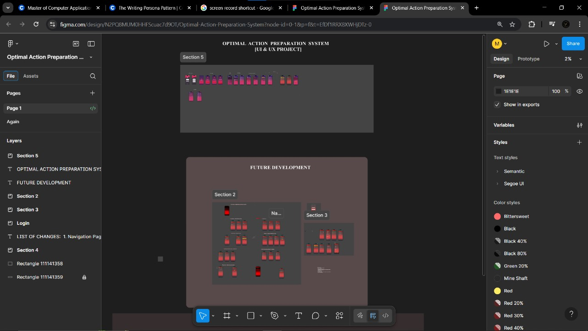

# 🚀 Optimal Action Preparation System (OAPS)

### Breaking Procrastination. Turning Intentions into Actions.

A productivity-focused application concept designed to help individuals overcome procrastination through structured planning, action preparation, and goal-oriented workflows.

---

## 📖 About the Project

**Optimal Action Preparation System (OAPS)** is a UI/UX design project focused on addressing one of the most common challenges faced by students, professionals, and entrepreneurs: **procrastination**.

The goal of the system is to provide users with a structured environment that helps them prepare, organize, prioritize, and execute tasks more effectively. Rather than simply managing tasks, OAPS focuses on preparing users for action, making it easier to begin and complete important work.

This repository currently contains:

- 🎨 High-Fidelity UI Designs
- 📐 Wireframes
- 🔄 User Flow Designs
- 🖥️ Interactive Prototype
- 📹 Project Demonstration Video
- 📝 Project Documentation

---

# 🖼️ Project Screenshot

## Landing Page

---

## 🎯 Problem Statement

Many individuals struggle with:

- Delaying important tasks
- Lack of motivation
- Poor prioritization
- Difficulty maintaining consistency
- Overwhelming workloads
- Ineffective planning methods

Traditional productivity tools often focus only on task tracking rather than helping users prepare themselves to take action.

OAPS aims to bridge this gap by creating a system that encourages effective preparation before execution.

---

## 💡 Proposed Solution

The Optimal Action Preparation System is designed to:

- Help users break down complex goals
- Create structured action plans
- Reduce procrastination
- Improve productivity
- Enhance focus and accountability
- Support consistent progress tracking

---

## ✨ Key Features

### 📋 Smart Task Preparation

Prepare and organize tasks before execution.

### 🎯 Goal Breakdown

Convert large objectives into smaller actionable steps.

### 📊 Progress Tracking

Monitor completion rates and productivity.

### ⚡ Productivity Workflow

Guide users from planning to execution.

### 📱 Responsive User Experience

Accessible across multiple device types.

### 🎨 Modern UI Design

Clean, intuitive, and user-centered interface.

---

## 🎨 Design Process

### 1. Research

- Understanding procrastination behavior
- Identifying productivity challenges
- Studying existing solutions

### 2. Wireframing

- Screen planning
- Navigation design
- User flow creation

### 3. UI Design

- High-fidelity interface development
- Visual consistency
- User experience optimization

### 4. Prototyping

- Interactive navigation
- Workflow simulation
- User journey validation

---

## 👥 Target Audience

- Students
- Professionals
- Entrepreneurs
- Freelancers
- Productivity Enthusiasts
- Individuals seeking better time management

---

## 🛠️ Tools Used

| Tool | Purpose |
|--------|----------|
| Figma | UI/UX Design |
| GitHub | Project Repository |

---

## 🚀 Future Scope

Planned future development includes:

- Full Frontend Implementation
- Backend Integration
- User Authentication
- Cloud Database Support
- Analytics Dashboard
- AI-Based Productivity Assistant
- Mobile Application Version

---

## 📹 Project Demonstration

A demonstration video showcasing the complete workflow and design prototype is available in this repository.

---

## 👨‍💻 Author

### Madan K K

Passionate about creating innovative solutions that improve productivity and user experience through technology and design.

GitHub: https://github.com/Madankk-06

---

### "Preparation Creates Momentum. Momentum Creates Results."

## Optimal Action Preparation System

